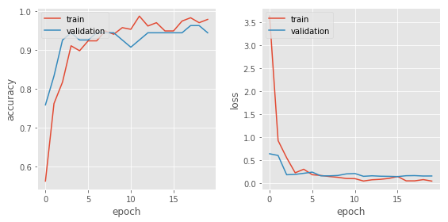
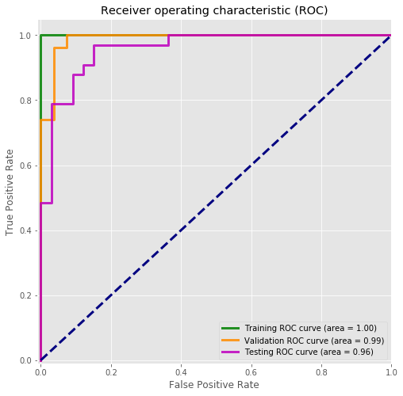

# Facial Recognition of Identical Twins using Convolutional Neural Networks
(in progress)

See the full code [here]().

Facial recognition has come a long way in the last few years, thanks to convolutional neural networks (CNNs). The question is, can neural nets tell identical twins apart? I have an identical twin brother, and on a number of occasions I’ve been able to unlock his iPhone with my face. Thus, facial recognition of similar-looking faces, while excellent, is still an important security issue that needs to be addressed.

Beginning with the VGG-Face pretrained model, I removed the last layer and added two Dense layers. The first Dense layer had 100 nodes and the second had 2 nodes. I then trained the CNN to distinguish between me and my identical twin brother. The final testing accuracy was 88%, with an area under the ROC curve of 0.94.

False Anthony

False Paul

