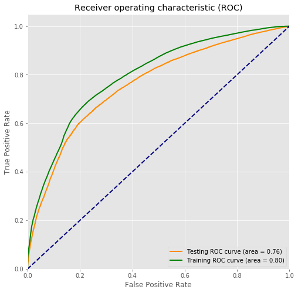

# Predicting Airbnb User Bookings with Supervised Machine Learning

Read the full report [here](https://github.com/Aejohnso/Springboard/blob/master/Capstone_1_Project/Final_Report.pdf).

See the python code [here](https://github.com/Aejohnso/Springboard/blob/master/Capstone_1_Project/Python_Code.ipynb).

## Project Summary 
Airbnb is an online tool for connecting homeowners (hosts) with people looking for a place to stay (users). More successful connections, or bookings, means more revenue, and so it is in Airbnb’s interest to make the user experience as smooth as possible. Airbnb thus uses data to optimize user experience and increase the number of bookings. 

In this capstone project, Airbnb user data was collected, cleaned, explored, and ultimately used to train a random forest classifier to predict if a user will make a booking or not. This predictive model may be useful to Airbnb in order to pick out which users need a little extra incentive to get them to make their first booking. The data was acquired from a Kaggle competition from 2015, [here](https://www.kaggle.com/c/airbnb-recruiting-new-user-bookings). 

The random forest classifier was optimized using randomized search cross-validation and a Monte Carlo algorithm. The final metric of interest, the ROC AUC, was 0.76. User age and gender turned out to be the most important. Generally, people who never made a booking tended to be slightly older than those who did. 

Below is the ROC curve for the final random forest classifier. The training and testing AUC values are 0.80 and 0.76, respectively.

