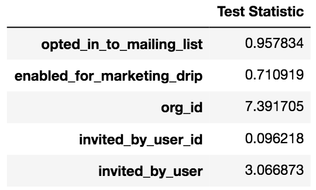
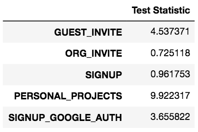

# Relax Inc. Takehome Challenge 

This challenge involves identifying which features in a dataset can be used to predict future user adoption.

See the full Python code [here](https://github.com/Aejohnso/Springboard/blob/master/Relax_Takehome_Challenge/Relax_code.ipynb).

See the original problem statement [here](https://github.com/Aejohnso/Springboard/blob/master/Relax_Takehome_Challenge/Problem_Statement.pdf).

### Summary of Results

An "is_adopted" value of 1 or 0 was calculated for each user. Adopted users were grouped together, and then statistical significance t-tests were carried out to compare the means and standard deviations. Based on the test statistics, below, we can say that adopted users tend to have higher org_ids and are more likely to have been invited by a user. And they are more likely to originate from a GUEST_INVITE or SIGNUP_GOOGLE_AUTH, and less likely to originate from PERSONAL_PROJECTS. 

Random Forest Classifiers and Gradient Boosted Classifiers were also attempted, but the highest achieved ROC AUC was 0.59. This means that the model is only slightly better than flipping a coin and should therefore not be used as a predictive model.  
