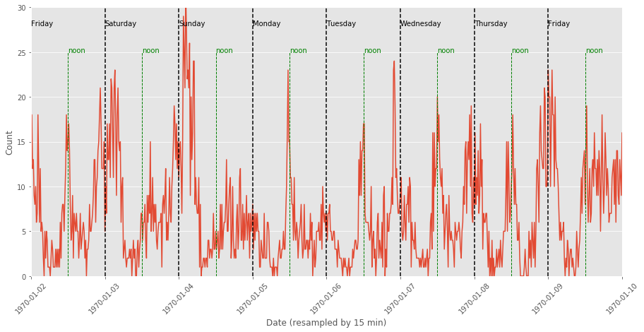
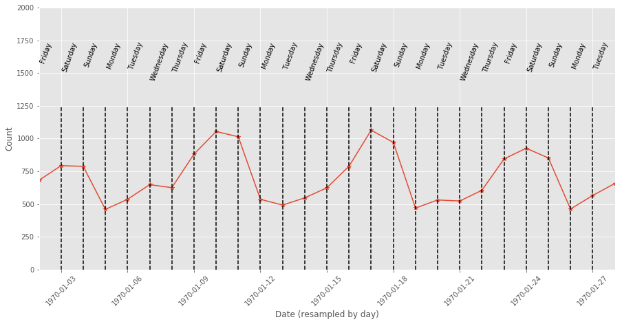
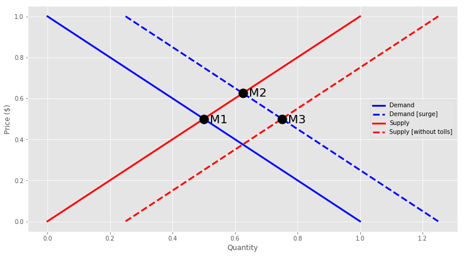
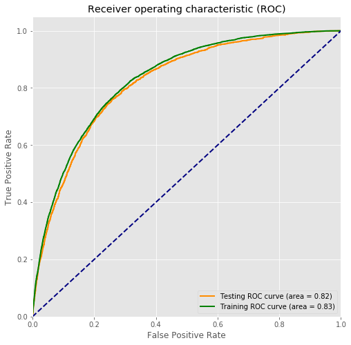

# Ultimate Inc. Takehome Challenge 

Split into 3 parts, this project involves time series analysis, A/B experiment design, and predictive modeling. 
See the full Python code [here](https://github.com/Aejohnso/Springboard/blob/master/Ultimate_Takehome_Challenge/Ultimate_code.ipynb).

### Part 1 ‐ Time Series Data Analysis

Below is are two plots showing the the daily and weekly patterns in the data.

### Part 2 ‐ A/B Experiment Design  

Below is a schematic of the driver Supply and Demand curves, as a way to conceptualize the problem.

### Part 3 ‐ Predictive Modeling of Active Users

Below is the ROC curve for the final Gradient Boosted Classifier. The training and testing AUC values are 0.83 and 0.82, respectively.

